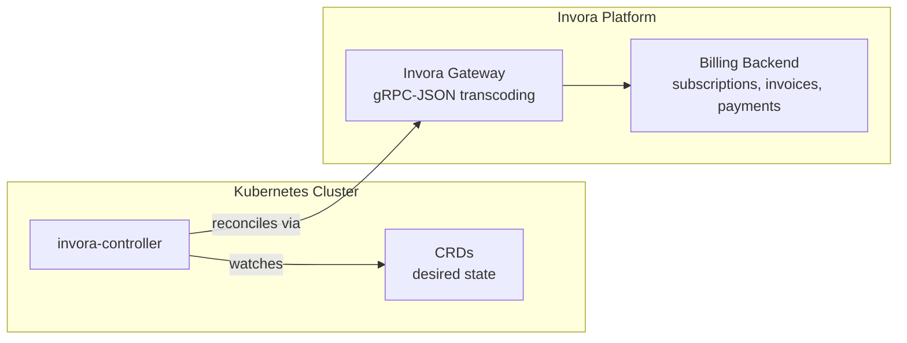
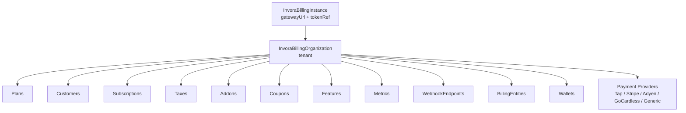

# Invora Controller

[](https://github.com/invoraapp/invora-controller/actions/workflows/ci.yaml)

Kubernetes operator that manages [Invora](https://invora.app) billing resources declaratively via Custom Resource Definitions (CRDs). Define your billing configuration as YAML — plans, customers, subscriptions, payment providers — and let the controller reconcile it against the Invora platform.

## Features

- **GitOps-native billing** — manage billing config alongside your infrastructure
- **19 CRD types** covering plans, customers, subscriptions, taxes, payment providers, and more
- **Per-provider payment CRDs** — type-safe schemas for Tap, Stripe, Adyen, GoCardless
- **Generic payment provider** — extensible CRD for future/custom integrations
- **Multi-tenant** — single controller instance manages multiple organizations
- **Environment-agnostic** — works on dev, staging, production, and self-hosted
- **Zitadel integration** — auto-provisions billing orgs from identity events
- **Helm chart included** — deploy with a single `helm install`

## Quick Start

### Install CRDs

```bash
kubectl apply -f https://raw.githubusercontent.com/invoraapp/invora-controller/main/config/crd/bases/
```

### Install via Helm

```bash
helm install invora-controller oci://ghcr.io/invoraapp/invora-controller/charts/invora-controller \
  --set image.tag=latest \
  --set watchNamespace=my-billing-namespace
```

### Define Your Billing

```yaml
apiVersion: core.invora.app/v1alpha1
kind: InvoraInstance
metadata:
  name: my-invora
  namespace: billing
spec:
  gatewayUrl: "https://gateway.invora.app"
  tokenRef:
    name: invora-sa-token
    key: token
---
apiVersion: billing.invora.app/v1alpha1
kind: InvoraBillingOrganization
metadata:
  name: my-company
  namespace: billing
spec:
  instanceRef:
    name: my-invora
  name: "My Company"
  email: "billing@mycompany.com"
  currency: "USD"
  timezone: "America/New_York"
  writeSecretToRef:
    name: my-company-billing-credentials
---
apiVersion: billing.invora.app/v1alpha1
kind: InvoraBillingPlan
metadata:
  name: starter
  namespace: billing
spec:
  organizationRef:
    name: my-company
  code: "starter"
  name: "Starter Plan"
  amountCents: 2900
  amountCurrency: "USD"
  interval: "monthly"
  payInAdvance: true
---
apiVersion: billing.invora.app/v1alpha1
kind: InvoraBillingStripeProvider
metadata:
  name: stripe-prod
  namespace: billing
spec:
  organizationRef:
    name: my-company
  code: "stripe_prod"
  name: "Stripe Production"
  secretKeyRef:
    name: stripe-credentials
    key: secretKey
  webhookSecretRef:
    name: stripe-credentials
    key: webhookSecret
  successRedirectUrl: "https://mycompany.com/billing/success"
```

## CRD Types

### core.invora.app/v1alpha1

| Kind | Short | Description |
|------|-------|-------------|
| `InvoraInstance` | `iinst` | Universal gateway connection (shared by all groups) |
| `InvoraBranch` | `ibranch` | Branch with regulation config, party info, DBA |
| `InvoraConnectedBusiness` | `icb` | Downstream tenant business |

### billing.invora.app/v1alpha1

| Kind | Short | Description |
|------|-------|-------------|
| `InvoraBillingOrganization` | — | Billing tenant/organization |
| `InvoraBillingPlan` | — | Subscription plan definition |
| `InvoraBillingCustomer` | — | Billing customer |
| `InvoraBillingSubscription` | — | Customer subscription |
| `InvoraBillingTax` | — | Tax rate |
| `InvoraBillingAddon` | — | One-time charge add-on |
| `InvoraBillingCoupon` | — | Discount coupon |
| `InvoraBillingFeature` | — | Plan entitlement feature |
| `InvoraBillingMetric` | — | Usage-based billable metric |
| `InvoraBillingWebhookEndpoint` | — | Webhook delivery endpoint |
| `InvoraBillingWallet` | `iwallet` | Prepaid credit wallet |
| `InvoraBillingTapProvider` | `ltap` | Tap Payments provider |
| `InvoraBillingStripeProvider` | `istripe` | Stripe provider |
| `InvoraBillingAdyenProvider` | `iadyen` | Adyen provider |
| `InvoraBillingGoCardlessProvider` | `igc` | GoCardless provider |
| `InvoraBillingPaymentProvider` | `ipay` | Generic payment provider |

### invoicing.invora.app/v1alpha1

| Kind | Short | Description |
|------|-------|-------------|
| `InvoraInvoicingRegulation` | `ireg` | Per-branch regulation enrollment (ZATCA, Peppol, ETA) |
| `InvoraInvoicingSettings` | `iset` | Tenant-level invoicing configuration |

## Architecture





The controller watches CRDs and reconciles them against the Invora billing backend through the gateway's gRPC-JSON transcoding endpoint. Authentication uses service account Bearer tokens with per-org scoping via `x-invora-org-id` headers.

## Configuration

### Helm Values

```yaml
image:
  repository: ghcr.io/invoraapp/invora-controller
  tag: latest

watchNamespace: ""  # empty = cluster-wide

zitadelSubscriber:
  enabled: false
  zitadelDomain: "auth.example.com"
  billingInstance:
    name: "my-billing"
    namespace: "billing"
```

### Environment Variables

| Variable | Description |
|----------|-------------|
| `WATCH_NAMESPACE` | Comma-separated namespaces (empty = all) |
| `BILLING_INSTANCE_NAME` | Zitadel subscriber target instance |
| `BILLING_INSTANCE_NAMESPACE` | Zitadel subscriber target namespace |
| `ZITADEL_DOMAIN` | Zitadel domain for event subscriber |
| `INVORA_ENV` | Environment (tenant ns = `invora-{env}`) |

## Release & Deployment

### Tag → GitHub Actions → artifacts

Push a semver tag (`v0.1.0`) to trigger [`.github/workflows/release.yaml`](.github/workflows/release.yaml). The pipeline:

1. Runs tests and Helm lint
2. Builds and pushes a **multi-arch** image (`linux/amd64`, `linux/arm64`) to GHCR
3. Syncs CRDs from `config/crd/bases/` into the Helm chart, packages the chart, and pushes it to **GHCR OCI**
4. Creates a **GitHub Release** with:
   - `invora-controller-<version>.tgz` — Helm chart (also on OCI)
   - `invora-controller-crds-<version>.yaml` — single-file CRD bundle for `kubectl apply -f`
   - `invora-controller-crds-<version>.tar.gz` — per-CRD tarball

```bash
# Install CRDs from a release
kubectl apply -f https://github.com/invoraapp/invora-controller/releases/download/v0.1.0/invora-controller-crds-0.1.0.yaml

# Install operator via Helm OCI
helm install invora-controller oci://ghcr.io/invoraapp/invora-controller/charts/invora-controller \
  --version 0.1.0 \
  --namespace invora-controller --create-namespace
```

Chart `version` and `appVersion` are both set to the semver tag (without `v`). The packaged chart defaults `image.repository` to GHCR and `image.tag` to the release version.

### Config Sync consumer pattern (invora/devops)

GKE Config Sync reconciles from Git — it does **not** fetch GitHub Release assets at sync time. Recommended pattern:

| Artifact | Source for Config Sync | Notes |
|----------|------------------------|-------|
| CRDs | **Embedded** `config-sync/invora-controller/crds.yaml` in Git | Pin to a release version; update via CI script or manual bump when CRDs change |
| Operator Deployment | Plain manifests or future Helm RootSync | Pin `image:` to `ghcr.io/invoraapp/invora-controller:<version>` |
| Tenant CRs | Git (instance, org, plans, …) | Unchanged |

**Do not** point Config Sync at `main` branch CRD URLs — use versioned release assets when bootstrapping manually, and commit the same CRD revision into the devops repo for ongoing GitOps.

Optional upgrade path: deploy the operator via a Config Sync **Helm RootSync** (`sourceType: helm`, `includeCRDs: true`) pointing at `oci://ghcr.io/invoraapp/invora-controller/charts/invora-controller` with an exact chart version. Keep tenant CR manifests in Git either way.

Suggested bump flow when cutting `vX.Y.Z`:

1. Tag and push in `invora-controller` — CI publishes GHCR image, OCI chart, and CRD release assets
2. In `invora/devops`, update `config-sync/invora-controller/crds.yaml` from the release bundle and pin `deployment.yaml` image to `ghcr.io/invoraapp/invora-controller:X.Y.Z`
3. Merge devops → Config Sync reconciles

## Development

```bash
# Prerequisites: Go 1.25+, controller-gen, Docker

# Build
go build ./...

# Test
go test ./... -v -race

# Generate deepcopy + CRD manifests
go install sigs.k8s.io/controller-tools/cmd/controller-gen@v0.17.2
controller-gen object paths="./..."
controller-gen crd paths="./..." output:crd:dir=config/crd/bases

# Run locally against current kubeconfig
go run ./cmd/main.go

# Build Docker image
docker build -t invora-controller:dev .
```

## License

Apache License 2.0 — see [LICENSE](LICENSE) for details.
